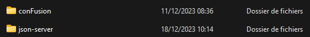

# Partie 4
Pour faire fonctionner la partie 4, il faut extraire le fichier `json-server.zip` à coté du dossier source du projet `confusion`, comme ça :

Ensuite, dans le dossier extrait `json-server`, il faut :
- install json-server avec la commande `npm install json-server -g`
- lancer avec la commande `json-server --watch db.json -d 2000`